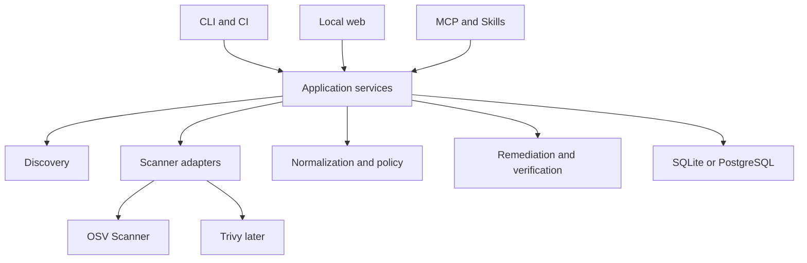

# DepRail Product Design

> Scanning, remediation, verification, and collaboration for developers and AI agents

## Executive Conclusion

DepRail is worth building, but its primary investment should not be another vulnerability database or scanning engine. It should reuse mature scanners and differentiate through cross-language normalization, change-risk analysis, safe remediation, automated verification, lightweight collaboration, and stable agent interfaces.

## Purpose

This document converts the initial market analysis into an actionable product definition. It explains who the product serves, which problem it solves, what the first release includes, how the system should work, and which evidence should justify continued investment.

The recommended shape is a local-first open-source CLI, an optional lightweight web collaboration layer, and thin Skill, Plugin, and MCP integrations. Scans must be reproducible, modifications reviewable, and every AI-generated remediation verified by the repository's own package manager, tests, type checks, and build.

## Recommended Decisions

| Decision | Recommendation | Rationale |
| --- | --- | --- |
| Start the project | Yes | Multi-language repositories and AI coding workflows have a real coordination gap |
| Primary interface | CLI | It is closest to the developer environment and works locally, in CI, and for agents |
| Scanner strategy | Adapt mature engines | Start with OSV-Scanner and later add Trivy instead of maintaining vulnerability intelligence |
| Main differentiation | Change risk and safe remediation | Answer what this change introduced and how it can be fixed with minimal risk |
| Web role | Lightweight collaboration | Show history, baselines, exceptions, and remediation status without cloning an enterprise ASPM |
| License | Apache-2.0 | Permissive commercial adoption with an explicit patent grant |

## Product Summary

A user runs one command in a repository. DepRail detects package managers and workspaces, invokes compatible scanners, merges duplicate findings, shows dependency paths and fixed versions, and identifies whether a risk is new in the current change. The user can generate a remediation plan, apply upgrades in an isolated workspace, run verification, rescan, and export a patch or pull request.

The web layer receives normalized results to show project trends, manage risk exceptions, assign remediation work, and review automation. Agents call the same capabilities through stable JSON commands or MCP tools; security logic is never duplicated inside a prompt or Skill.

## Vision and Boundaries

### Vision

Enable developers to understand dependency risk, choose a viable upgrade, and prove through their own test suite that the remediation did not break the product, without requiring them to become supply-chain security specialists.

### Positioning

DepRail is a local-first dependency security workspace for individual developers and small teams. It supports multi-language repositories, CI, and AI coding tools, connecting mature scanners to the real remediation workflow: triage, planning, change, verification, and review.

### Explicit Non-goals

- Do not build a global vulnerability database in the early stages.
- Do not expand the first year into SAST, DAST, cloud security, or a complete ASPM platform.
- Do not upload source code by default; the web layer initially receives results and necessary metadata only.
- Do not allow an agent to modify dependencies and merge without confirmation.
- Do not promise zero false positives; expose evidence, source, and confidence for review.

## Market Position

Mature tools already cover dependency discovery and vulnerability matching. Trivy offers broad target and scan coverage. OSV-Scanner offers ecosystem scanning, call analysis, and guided remediation. Dependency-Track offers organization-scale SBOM management. Snyk, Semgrep, and Socket provide commercial intelligence and governance. Supporting more manifest files alone is not a defensible product strategy.

| Product | Mature capability | Remaining opportunity for DepRail |
| --- | --- | --- |
| Trivy | Broad targets, scan types, and a mature ecosystem | A unified remediation workflow and lightweight collaboration for small teams |
| OSV-Scanner | Source and container scanning, call analysis, guided remediation | Cross-scanner history and a complete collaborative remediation loop |
| Grype | Image, filesystem, and SBOM vulnerability scanning | A developer workflow from source discovery through verified change |
| cdxgen and dep-scan | Multi-format BOM, reachability, server, and agent integration | Differentiation through change analysis and verification evidence |
| Dependency-Track | SBOM inventory, policy, audit, notification, and metrics | A lighter local workflow tied directly to source remediation |
| Dependabot and GitLab | Hosted upgrade automation and alerts | Cross-host and local workflows with consistent contracts |
| Snyk, Semgrep, Socket | Commercial intelligence, reachability, malicious-package detection, and governance | Open-source, self-hosted, and data-boundary requirements |

### Opportunity Assessment

| Approach | Value | Decision |
| --- | --- | --- |
| New scanner and vulnerability database | Low | High cost with no data advantage; reject |
| Unified wrappers around ecosystem commands | Medium-low | Useful foundation but not sufficient differentiation |
| Normalized multi-language results | Medium | Valuable only when combined with diff and remediation |
| Scan-to-verification loop | High | Directly reduces time spent triaging and recovering from failed upgrades |
| Agent-native and local-first operation | High | Gives AI tools a safe, stable, and reviewable dependency interface |

## Target Users

| User | Current situation | Job to be done | Product value |
| --- | --- | --- | --- |
| Multi-language individual developer | Maintains frontend, Python, and Java services | Scan the repository once and receive actionable remediation | Less tool switching and ecosystem-specific knowledge |
| Small engineering team | No dedicated AppSec and a large historical backlog | Block new high-risk issues while paying down debt gradually | Baselines and diffs avoid an all-at-once cleanup |
| Monorepo maintainer | Multiple workspaces and package managers coexist | Locate the owning workspace and dependency path | Unified project model and cross-workspace view |
| AI coding-tool user | Agent can edit code but tool permissions are inconsistent | Scan, plan, and verify through controlled steps | Stable JSON, dry-run, and approval boundaries |
| Open-source maintainer | Must reproduce security reports and assess upgrade PRs | Verify the smallest safe change with public evidence | Reviewable evidence and change summaries |

Large enterprise AppSec teams are not the first target. They normally require asset inventory, compliance mapping, complex RBAC, ticketing, and commercial intelligence. DepRail should interoperate through APIs, CycloneDX, SARIF, VEX, and webhooks rather than attempting to replace enterprise suites.

## Core User Questions

1. Which ecosystems and project boundaries exist, and which lockfiles are authoritative?
2. Why do scanners disagree on severity and affected ranges?
3. Is the finding direct or transitive, and is the dangerous path reachable?
4. Is it historical debt or newly introduced by this change?
5. Which package and version should change, and does that imply a breaking migration?
6. Do tests, type checks, and builds still pass after remediation?
7. If the risk is deferred, who accepted it, why, and when must it be reviewed?

## Product Principles

| Principle | Constraint |
| --- | --- |
| Local first | Scanning and remediation run in the user environment by default |
| Evidence first | Preserve scanner, database, dependency path, and affected-range provenance |
| Deterministic core | Discovery, matching, policy, and change application must work without an LLM |
| Controlled AI | LLMs may explain or assist migration, while write operations require plans, permissions, and tests |
| Incremental adoption | One command works alone; CI, web, MCP, and team features remain optional |
| Open standards | Prefer CycloneDX, SPDX, SARIF, VEX, PURL, and OSV formats |
| Reviewable by default | Never hide raw evidence behind an unexplained score |

## Capability Model

| Layer | Responsibility | Primary output |
| --- | --- | --- |
| Discovery | Detect repositories, workspaces, languages, package managers, and build files | Project inventory and scan plan |
| Collection | Invoke OSV-Scanner, Trivy, and native tools | Provenance-preserving raw results |
| Normalization | Unify package identifiers, aliases, severity, fixed versions, and paths | Normalized findings |
| Decision | Deduplicate, compare baselines, apply policy, and prioritize exploitability | Gate result and priority |
| Remediation | Generate minimal upgrades, apply changes, and address transitive dependencies | Remediation plan and diff |
| Verification and collaboration | Run tests/builds, manage exceptions, publish results, and create PRs | Verification evidence and review record |

## Core Workflows

### First Scan

1. Run `deprail scan .` at the repository root.
2. Review detected workspaces, package managers, lockfiles, and planned scanners.
3. DepRail executes scanners and retains raw results.
4. The normalization layer merges aliases and duplicate components.
5. The terminal shows actionable results first while preserving full evidence.

```bash
deprail scan .
deprail scan . --format json --output scan.json
deprail scan . --severity high --fail-on new
```

### Pull Request Risk Check

1. Read or produce a baseline for the target branch.
2. Scan the current commit and identify added, upgraded, and removed dependencies.
3. Return a non-zero exit code only when a new finding violates policy.
4. Post a concise PR summary with a link or artifact containing full evidence.

```bash
deprail diff --base origin/main --head HEAD
deprail policy check --baseline .deprail/baseline.json --format sarif
```

### Safe Remediation

1. Generate one or more candidate upgrades based on direct or transitive relationships.
2. Review the files, versions, and verification steps in the plan.
3. Apply the change in an isolated branch or worktree.
4. Run detected tests, type checks, and builds.
5. Rescan and report resolved findings, residual risk, and compatibility failures.

```bash
deprail fix plan GHSA-xxxx-xxxx-xxxx
deprail fix apply --plan .deprail/plans/plan-001.json --dry-run
deprail fix apply --plan .deprail/plans/plan-001.json --verify
```

### Risk Exceptions

An exception is a structured, expiring record rather than a permanent ignore. It includes the finding identifier, scope, rationale, approver, creation time, expiry, and review condition. Expired exceptions reappear in CLI and web views and may fail CI.

## CLI Product Design

| Command | Purpose | MVP |
| --- | --- | --- |
| `deprail discover` | Detect projects, workspaces, and scan plan | Yes |
| `deprail scan` | Produce terminal, JSON, SARIF, or CycloneDX output | Yes |
| `deprail diff` | Compare a baseline, branches, or two scan results | Yes |
| `deprail explain` | Explain a vulnerability, dependency path, evidence, and options | Yes |
| `deprail policy check` | Decide pass, warn, or block | Yes |
| `deprail fix plan` | Generate a reviewable remediation plan | Phase 2 |
| `deprail fix apply` | Apply an upgrade and verify it | Phase 2 |
| `deprail publish` | Send results to the web layer or another platform | Phase 2 |
| `deprail serve` | Start the local web application and API | Phase 2 |
| `deprail doctor` | Diagnose configuration and scanner availability | Yes |

Machine output is versioned. JSON and other structured formats go to stdout, diagnostics go to stderr, and ANSI color is disabled when output is redirected. Exit codes distinguish policy failure, configuration error, incomplete scanning, remediation failure, and required approval.

```yaml
version: 1
project:
  name: deprail
scan:
  adapters: [osv]
  timeout: 2m
policy:
  fail_on: new
  minimum_severity: high
privacy:
  telemetry: false
```

## Web Product Design

The web application is a collaboration layer, not a second implementation of the scanner. Its information architecture includes projects, scan history, finding detail, baselines, exceptions, remediation plans, verification runs, integrations, and audit events.

The project overview emphasizes risk introduced by the latest change, incomplete scans, expiring exceptions, and remediation status. Finding detail preserves aliases, component identity, paths, raw evidence, fixed versions, decisions, and related changes. Local mode uses an embedded React application and SQLite; team mode later adds PostgreSQL, object storage, identity, and RBAC.

## Agent and Skill Design

Recommended MCP tools are read-oriented by default: `discover`, `scan`, `get_finding`, `explain`, `diff`, and `create_fix_plan`. Write-capable tools such as `apply_fix`, `publish`, and `create_pull_request` require explicit scopes and approval.

Agent safety constraints:

- Separate read, write, network, and publish permissions.
- Return structured schemas rather than terminal text.
- Support dry-run and plan-only modes.
- Require the agent to surface planned commands and affected files.
- Record verification evidence and retain an audit trail.
- Never expose tokens, full environment variables, or credential-bearing URLs.

## Risk Model

Priority must not be a single opaque score. DepRail combines severity, directness, reachability evidence, exploit maturity, environmental exposure, age, remediation availability, and whether the finding is new. The UI and JSON retain each factor.

Recommended default gating starts with new high or critical findings, incomplete scan status, expired exceptions, and policy violations. Historical debt is visible but does not block adoption by default.

## Technical Architecture



Use a Go single-binary core, Cobra for the CLI, versioned JSON Schema, an explicit adapter contract, SQLite locally, PostgreSQL for team mode, REST with OpenAPI 3.1, and React with TypeScript and Vite. External scanners run as controlled child processes. Raw results are stored as content-addressed artifacts so normalization can be replayed offline.

Stable identifiers use normalized package URLs and sorted vulnerability alias sets. Finding keys exclude volatile fields such as descriptions, severity, timestamps, and evidence order.

## Remediation Engine

A remediation plan states the affected finding, candidate versions, files to change, package-manager commands, expected lockfile changes, migration notes, verification commands, rollback, and confidence. The engine prefers the minimum non-vulnerable version, distinguishes direct from transitive upgrades, detects major-version jumps, and never silently substitutes the latest version.

Verification follows `plan -> approve -> apply -> test -> build -> rescan -> summarize`. Failed verification preserves the workspace and evidence for inspection while keeping the original repository unchanged.

## Security and Privacy

Primary threats include command injection, path traversal, symlink escape, unbounded scanner output, malicious manifests, credential leakage, unsafe install scripts, tampered artifacts, and over-privileged agents. External commands use argument arrays, contexts, timeouts, output limits, and explicit working directories. Discovery never follows paths outside the repository. Source code remains local by default, telemetry is opt-in, and uploads contain only declared metadata.

## Version Roadmap

| Version | Outcome |
| --- | --- |
| v0.1 | Multi-language discovery, OSV adapter, normalization, terminal and JSON reports |
| v0.2 | Baseline diff, policy gates, SARIF, and GitHub Action preview |
| v0.3 | Reviewable remediation plans without workspace mutation |
| v0.4 | Isolated application, verification, rescan, and patch delivery |
| v0.5 | Local web application and scan history |
| v0.6 | Self-hosted team collaboration, identity, RBAC, and exceptions |
| v0.7 | MCP and agent access with explicit scopes and audit |
| v0.8 | Trivy, open formats, and an external adapter protocol |
| v0.9 | Contract freeze, performance, security hardening, and release candidate |
| v1.0 | Stable contracts, documented migration policy, and production release |

## Open-source Project Design

The repository separates command entry points, deterministic domain logic, application services, adapters, schemas, fixtures, documentation, and the web interface. Apache-2.0 is recommended. Architectural decisions use ADRs, schema changes require compatibility review, and extensions remain process-isolated. Releases publish checksums, SBOMs, signatures, provenance, compatibility notes, and reproducible tool versions.

## Community and Adoption

Initial content should demonstrate mixed-repository scanning, diff-based CI gating, safe agent use, and remediation failures that ordinary bots miss. The adoption funnel is install, first scan, repeat local use, CI integration, baseline management, and finally collaboration. Measure completion and repeat usage rather than download counts alone.

## Commercial Boundary

The open-source core includes local discovery, scanning, normalization, policy, remediation planning, verification, open formats, and local history. A future paid or hosted layer may add managed collaboration, enterprise identity, retention, fleet visibility, commercial intelligence, and support. Core safety behavior and portable data formats must not be paywalled.

## Success Metrics

- First useful scan within five minutes, excluding a first vulnerability database download.
- At least 90% supported-repository scan success before v0.2 exits preview.
- Deterministic normalized results for identical input, versions, and database state.
- No false-safe result when any target is incomplete.
- A measurable reduction in time from finding to verified patch.
- Healthy review latency, issue response, contributor retention, and release cadence.

## Principal Risks and Responses

| Risk | Response |
| --- | --- |
| Scanner output changes | Pin versions, maintain contract fixtures, and fail with explicit incompatibility |
| Too much scope | Enforce version gates and keep non-goals visible |
| Unsafe automatic changes | Require plans, isolation, verification, and approval |
| Cross-platform drift | Test semantic output on Linux, macOS, and Windows |
| Alert fatigue | Default to new-risk gating and preserve historical debt as a baseline |
| Agent overreach | Use scoped tools, dry-run, audit records, and human confirmation |

## Initial Eight-week Plan

Weeks 1-2 establish repository structure, schemas, fixtures, CLI contracts, and CI. Weeks 3-5 implement discovery across JavaScript, Python, and Java plus the OSV adapter. Weeks 6-8 complete normalization, deterministic reporting, failure handling, real-repository validation, documentation, and an internal v0.1 preview.

## Decisions Required Before Launch

Confirm the final Go module path, Apache-2.0 licensing, supported OSV-Scanner range, the default raw-artifact retention policy, the exact v0.1 platform matrix, and whether preview releases are signed from the first public build.

## Final Recommendation

Proceed with DepRail as a local-first dependency security guardrail. Build the deterministic CLI and contracts first, validate multi-language discovery and complete failure semantics, then add diff-based gating and verified remediation. Delay the web layer, team services, and broad scanner expansion until repeated use proves they solve a real problem.

## Appendix Example Structured Result

```json
{
  "schema_version": "v1alpha1",
  "status": "complete",
  "project": {"name": "example-monorepo"},
  "findings": [
    {
      "key": "pkg:npm/example@1.0.0|GHSA-xxxx-xxxx-xxxx",
      "component": {"purl": "pkg:npm/example@1.0.0"},
      "vulnerability": {"canonical_id": "GHSA-xxxx-xxxx-xxxx", "aliases": ["CVE-2099-0001"]},
      "evidence": [{"source": "osv", "workspace": "apps/web"}],
      "fixed_versions": ["1.0.1"]
    }
  ]
}
```

## Appendix Reference Standards

- OSV schema and OSV-Scanner documentation
- Package URL specification
- CycloneDX, SPDX, VEX, and SARIF specifications
- OpenAPI 3.1 and JSON Schema
- SLSA provenance and Sigstore/Cosign release signing
