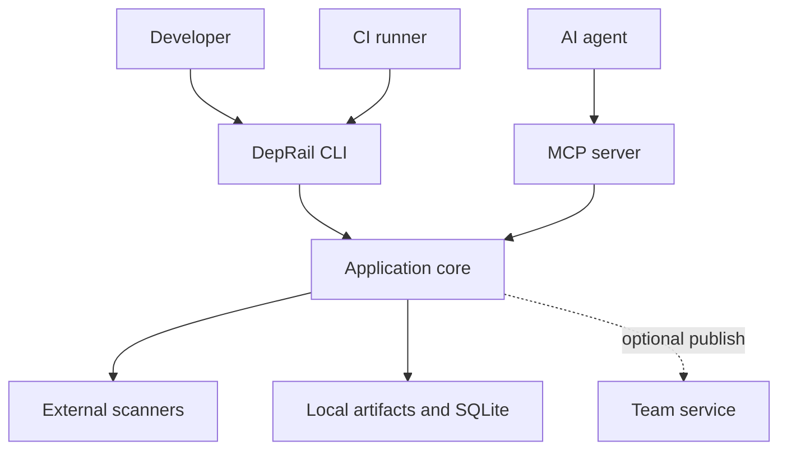
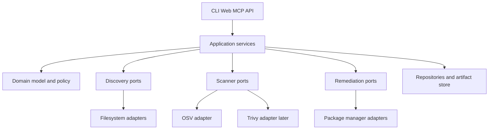

# DepRail Architecture and Technology Stack

> Engineering baseline for development, automated testing, CI integration, and agent access

| Attribute | Value |
| --- | --- |
| Document version | 1.1 |
| Status | Recommended implementation baseline |
| Date | 2026-09-17 |
| Related product document | DepRail Product Design v1.0 |
| Target path | v0.1 scanning prototype through v1.0 stable release |

## 1. Executive Summary

Use a Go single-binary core, external scanner adapters, versioned domain schemas, an embedded React local console, and an optional server. Do not rebuild scanners or vulnerability databases. Keep discovery, normalization, diff, policy, and remediation planning deterministic. v0.1 through v0.3 require no server. Design contracts before web features, and route CLI, CI, web, and MCP through the same application layer.

| Layer | Preferred technology |
| --- | --- |
| CLI and core | Go, Cobra, `slog`, `context`, `os/exec` |
| Configuration | YAML validated by JSON Schema; `.deprail.yaml` |
| Local storage | SQLite plus content-addressed raw artifacts |
| Team storage | PostgreSQL and optional object storage |
| API | Go REST API with OpenAPI 3.1 |
| Local web | React, TypeScript, Vite; embedded static assets |
| Agent | MCP server and thin Skills over the same application services |
| CI | GitHub Actions; JSON, SARIF, and JUnit; three-OS matrix |
| Release security | SBOM, checksums, Cosign signatures, provenance, pinned tools |

## 2. Architecture Goals and Quality Attributes

| Priority | Attribute | Engineering meaning |
| --- | --- | --- |
| P0 | Correctness and explainability | Every finding traces to a scanner, database record, component, and path |
| P0 | Reproducibility | Identical repository, configuration, scanner, and database state produce stable domain output |
| P0 | Security boundary | No install scripts by default; read and write capabilities are separated |
| P0 | Compatibility | Linux, macOS, Windows, and common CI environments work consistently |
| P1 | Extensibility | A new ecosystem or scanner does not require domain-core changes |
| P1 | Testability | Every adapter is replayable offline with fixed fixtures |
| P1 | Performance | A warm scan of a common multi-language repository targets under two minutes |
| P2 | Collaboration | Team services do not contaminate or become prerequisites for the local core |

Non-goals include building vulnerability intelligence, adding SAST/DAST/IaC/secrets to the domain model, loading untrusted in-process plugins, inventing a universal dependency graph, or requiring cloud services for core use.

## 3. System Context



The trust boundary is explicit. Repository contents and scanner output are untrusted inputs. The local core owns validation, normalization, policy, and file-system containment. Publishing is a separate permission and is never implied by scanning.

## 4. Component Architecture



Dependencies point inward. The domain package imports neither Cobra nor SQL nor scanner-specific types. Entry points translate transport inputs into application commands. Adapters implement ports. Schema packages define serialized contracts and explicit version conversions.

## 5. Key Data Flows

### 5.1 Scan

1. Resolve configuration and repository root.
2. Walk the repository without escaping its root.
3. Build a deterministic `ProjectGraph` and diagnostics.
4. Select adapters and create a `ScanPlan`.
5. Execute each scanner with argument arrays, timeouts, and output limits.
6. Save raw stdout, stderr metadata, tool version, and a digest.
7. Parse raw scanner output into source-specific records.
8. Normalize components, aliases, severity, fixes, and evidence.
9. Compute completeness and policy decisions.
10. Render terminal or machine output through dedicated presenters.

### 5.2 Remediation

1. Load a finding and current repository state.
2. Generate candidates without mutation.
3. Produce a serializable plan with commands, files, risks, and checks.
4. Require approval for write capability.
5. Create an isolated worktree or temporary copy.
6. Apply package-manager operations without shell interpolation.
7. Run declared verification, rescan, and compare.
8. Return a patch, evidence bundle, or PR request; never merge automatically.

## 6. Modules and Responsibilities

| Module | Responsibility |
| --- | --- |
| `discovery` | Repository walking, ignore rules, project detectors, completeness |
| `scanplan` | Match projects to compatible adapters and execution units |
| `adapter` | Scanner metadata, compatibility, execution, and parsing contracts |
| `process` | Safe subprocess execution, cancellation, timeout, and bounded output |
| `artifact` | Content-addressed raw results and integrity metadata |
| `normalize` | PURL, aliases, severity sources, fixed versions, stable keys |
| `policy` | Baseline comparison, exceptions, decisions, and exit status |
| `remediation` | Candidate plans, isolated changes, verification, rollback |
| `presenter` | Terminal, JSON, SARIF, CycloneDX, and JUnit output; v0.3.1 adds the structured human-rendering boundary. |
| `store` | SQLite/PostgreSQL repositories and migrations |
| `api` | OpenAPI transport with authentication and request limits |

## 7. Technology Decisions

### 7.1 Go Core

Go provides a portable single binary, strong process and concurrency primitives, straightforward cross-compilation, and a small operational surface. Cobra is limited to CLI wiring. Domain code accepts plain structs and interfaces. Use standard `context` cancellation, `slog` structured logging, `os/exec` without a shell, and `io.LimitReader` or equivalent bounded capture.

### 7.2 Scanner Strategy

OSV-Scanner is the first adapter because its open vulnerability model and ecosystem coverage align with source dependency scanning. Trivy is added later for broader inputs and cross-validation. Each adapter exposes metadata, supported target types, compatibility checks, plan construction, execution, parsing, and normalization. Tool version incompatibility is a diagnosable failure, not an empty success.

### 7.3 Web

React, TypeScript, and Vite produce an embeddable static application for local mode. A dedicated server framework is deferred until hosted requirements justify it. The UI consumes the same OpenAPI contract used by other clients and does not contain security policy logic.

### 7.4 API

REST with OpenAPI 3.1 is sufficient for resources, jobs, scans, findings, exceptions, and remediation plans. Long operations are jobs with explicit status. Requests use idempotency keys where mutation may be retried. Pagination, schema versions, error codes, and audit metadata are part of the contract.

### 7.5 Storage

SQLite stores local indexes, scans, findings, decisions, and settings. Raw scanner data lives in a digest-addressed directory, avoiding large opaque blobs in database rows. Team mode replaces repositories with PostgreSQL implementations and may move artifacts to object storage. Migrations are forward-only, tested, and backed up before destructive transformations.

### 7.6 Policy

The first policy engine is a typed internal evaluator configured through YAML. It supports severity thresholds, new-versus-baseline decisions, completeness, exception expiry, and adapter failures. A general policy language is deferred until real rules show the need.

```yaml
version: 1
policy:
  fail_on: new
  minimum_severity: high
  require_complete_scan: true
  expired_exceptions: block
```

### 7.7 MCP and Agents

The MCP server invokes application services directly or through a stable local API. Tool schemas are versioned. Read-only capabilities are the default. Mutation, network publishing, and PR creation are independent scopes. Every write tool supports plan or dry-run output and returns the exact files, commands, and verification results.

## 8. Core Data Contracts

Stable keys derive from canonical PURL, resolved version, normalized vulnerability alias set, and relevant project scope. They exclude prose descriptions, timestamps, evidence ordering, and mutable severity labels. Schema evolution follows additive changes within an alpha line, explicit converters for breaking changes, golden examples, and compatibility tests.

Core entities are `Project`, `Workspace`, `ScanPlan`, `Scan`, `Component`, `Vulnerability`, `Finding`, `Evidence`, `Decision`, `Exception`, `RemediationPlan`, and `VerificationRun`.

## 9. Recommended Repository Structure

```text
cmd/deprail/                 CLI entry point
cmd/deprail-mcp/             MCP entry point
internal/app/                application services
internal/domain/             deterministic entities and rules
internal/discovery/          walkers and detectors
internal/adapters/osv/       OSV integration
internal/process/            safe process runner
internal/artifact/           content-addressed storage
internal/normalize/          identifiers and merge logic
internal/policy/             decisions and baselines
internal/remediation/        planning and verification
internal/presenter/          terminal and machine formats
internal/store/              persistence implementations
schemas/                     versioned JSON Schema and examples
web/                         React and TypeScript application
testdata/                    fixed scanner and repository fixtures
docs/                        ADRs, architecture, and contributor guides
```

## 10. Test Architecture

Use unit tests for domain invariants, contract tests for adapters and stores, golden tests for serialized output, integration tests for controlled child processes and SQLite, cross-platform smoke tests, property tests for order independence and stable keys, and fuzz tests for parsers and hostile paths.

| Area | Required cases |
| --- | --- |
| Discovery | Nested workspaces, conflicting lockfiles, ignored directories, symlinks, Unicode, malformed manifests |
| Process runner | Cancellation, timeout, non-zero exit, large output, spaces and metacharacters |
| Adapter | Supported and incompatible versions, valid JSON, malformed JSON, partial results |
| Normalization | Alias permutations, duplicate evidence, missing PURL, multiple severity sources |
| Output | TTY/non-TTY, stdout/stderr separation, atomic writes, stable ordering |
| Storage | Migration, crash recovery, digest validation, concurrent readers |

Fixtures must be minimal, synthetic where possible, license-safe, offline, and documented with expected behavior. Generated fixtures record the generator version and input. Golden updates require human review when many files change.

## 11. CI and Release

Pull requests run formatting, lint, unit tests, schema validation, generation checks, targeted integration tests, and a build on all supported platforms. Nightly runs broader real-repository and fuzz/regression suites. Releases build reproducibly, generate an SBOM, create checksums, sign artifacts and provenance, run installation smoke tests, and publish compatibility notes.

## 12. Local Development

Required tools are a pinned Go toolchain, Node and package manager only when working on the web layer, OSV-Scanner for integration tests, and platform build tools. Common commands:

```bash
make bootstrap
make generate
make test
make lint
make build
make verify
make test-integration
```

The repository pins exact versions in configuration and CI. Dependabot or Renovate may propose upgrades, but scanner and schema-tool upgrades require contract-fixture review.

## 13. Security Design

Never concatenate shell commands. Pass arguments directly, set the working directory, inherit only approved environment variables, apply deadlines, cap output, and terminate process trees on cancellation. Resolve paths against a canonical repository root, reject traversal, and refuse symlink escape. Write files atomically with restrictive permissions and do not execute package install scripts unless a reviewed plan explicitly permits them.

Team services require TLS, authenticated APIs, least-privilege service credentials, request and artifact size limits, tenant isolation, audit records, and secrets outside configuration files. Upload endpoints treat all content as hostile.

## 14. Observability and Diagnostics

Structured debug logs include scan ID, workspace ID, adapter, phase, duration, and stable error code. They exclude tokens, credential URLs, full environment dumps, and source content. User-facing diagnostics provide a concise message, affected scope, cause, suggested action, and reference code.

## 15. Performance and Concurrency

Parallelize independent workspaces with a bounded worker pool. Scanner concurrency is configurable and conservative by default. Cache only content-addressed inputs that include repository state, configuration, tool version, and database identity. Determinism takes precedence over small throughput gains.

## 16. Deployment Topologies

Local mode is one binary, an optional browser window, SQLite, and a private artifact directory. Team mode separates API workers, PostgreSQL, optional object storage, identity, and background jobs. The local core remains fully useful without the team service.

## 17. Phased Implementation

| Version | Architecture increment | Exit evidence |
| --- | --- | --- |
| v0.1 | Discovery, OSV adapter, artifact storage, normalization, CLI output | Mixed repository scan is stable and complete failures are explicit |
| v0.2 | Baselines, diff, policy, SARIF, GitHub Action | New-risk gates work on real PRs |
| v0.3 | Remediation model and planners | Plans are accurate without mutating the repository |
| v0.3.1 | Structured presentation events, TTY-aware terminal rendering, safe human summaries | JSON/stdout/stderr, status, security, and three-OS terminal evidence pass |
| v0.4 | Isolated executor and verification | Failed changes are contained and evidence is retained |
| v0.5 | SQLite history, local REST API, embedded React | Local history solves a repeated user need |
| v0.6 | PostgreSQL, identity, RBAC, team workflows | Multi-user collaboration is reliable and auditable |
| v0.7 | MCP tools, scopes, approvals, audit | Agents cannot exceed granted capabilities |
| v0.8 | Trivy and external adapter protocol | Extensions remain isolated and contract-tested |
| v0.9 | Freeze, migration, performance, security | Release-candidate gates pass |
| v1.0 | Stable schemas, support and deprecation policy | Go/No-Go review approves production release |

## 18. Architecture Decision Records

Create ADRs for the Go core, external-process adapter model, stable identifiers, storage split, web embedding, policy engine, remediation isolation, MCP permissions, and schema-version rules. An ADR records context, decision, alternatives, consequences, migration, and validation.

## 19. Definition of Ready Before Coding

- Repository and module names are final.
- License and contribution policy are present.
- v1alpha schemas and example documents validate.
- CLI output and exit-code contracts are reviewed.
- Supported OSV-Scanner range is pinned.
- Fixtures cover npm, Python, Java, and a mixed monorepo.
- CI commands work locally and in GitHub Actions.
- High-risk operations have an owner reviewer; independent review is optional.

## 20. v0.1 Definition of Done

Discovery supports the stated ecosystems, every target has a clear completeness state, OSV execution is bounded and replayable, normalization is deterministic, terminal and JSON output are correct, three-OS smoke tests pass, real repositories are manually validated, and release artifacts contain checksums plus documented signing status.

## 21. Key Risks and Alternatives

If OSV output is unstable, isolate it behind version-specific parsers. If Go web embedding slows iteration, keep the web build separate until release packaging. If SQLite locking becomes visible, use a single writer and queued jobs before changing databases. If policy requirements become complex, evaluate OPA only after real rules exceed the typed evaluator.

## 22. Maintenance Sources

Treat official OSV, Go, OpenAPI, JSON Schema, SQLite, PostgreSQL, React, Vite, GitHub Actions, CycloneDX, SPDX, SARIF, Sigstore, and SLSA documentation as normative. Record the date and relevant version when an architectural decision depends on changing upstream behavior.

## Appendix A Initial Work Items

Start with repository baseline, toolchain and CI, templates, core schemas, fixtures, detector contract, secure walker, npm detector, discovery CLI, adapter contract, process runner, OSV adapter, artifact store, normalization, presenters, and contract tests.

## Appendix B First Sprint Recommendation

The first demonstrable vertical slice detects one npm fixture and emits a stable `ProjectGraph` through `deprail discover --format json`. It must already follow path containment, deterministic ordering, stdout/stderr, schema validation, and cross-platform rules.
