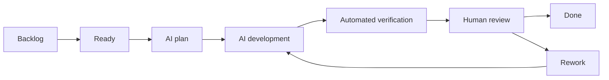

# DepRail Complete Development Execution Plan

| Attribute | Value |
| --- | --- |
| Version | 1.0 |
| Date | 2026-09-17 |
| Delivery model | One project owner working with AI agents |
| Baseline duration | 57 delivery weeks plus 10-15% contingency |
| Cadence | Two-week Sprints; one-week Sprint 0 |
| First public preview | v0.2 CI guardrail |

## 1. Plan Conclusion

DepRail can be built by one owner with AI assistance only if AI output rate is separated from human verification capacity. AI may accelerate implementation, tests, fixtures, and documentation. Product correctness, security boundaries, compatibility, and release decisions remain human responsibilities.

Finish v0.1 and v0.2 before committing to the full roadmap. Give each Sprint one demonstrable outcome, limit implementation WIP to two tasks, require code plus tests plus documentation plus evidence, and use milestone gates rather than schedule pressure to control scope.

## 2. Assumptions

The owner contributes roughly 15-20 hours each week for product decisions, task design, architecture approval, review, exploratory testing, release, and community work. AI agents are invoked for bounded implementation tasks. External contributors are not on the critical path. If owner time falls below ten hours a week, extend dates instead of accumulating unreviewed changes.

The technical baseline is the Go core, OSV-Scanner first, versioned schemas, React/Vite local UI, SQLite locally, PostgreSQL for teams, and thin MCP/Skill entry points. First-year scope excludes a vulnerability database, SAST/DAST/ASPM, default source upload, unapproved writes or PRs, and untrusted in-process plugins.

## 3. Delivery Model

WIP limits: at most two tasks in implementation and two PRs in human review. Prefer fewer than 400 net new business-code lines per PR, excluding fixtures and generated files. One PR solves one primary problem. Only one high-risk task runs at a time. When review is full, AI work shifts to tests, documentation, or reproduction.

Use trunk-based development, short-lived branches, squash merges tied to Issue IDs, and at least one runnable internal preview per Sprint. v0.x.0 denotes capability stages; v0.x.y is reserved for fixes and compatibility. Feature freeze begins at v0.9.

## 4. Human and AI Responsibilities

AI is suitable for bounded modules with approved interfaces, table-driven tests, fixtures, parsers, CLI help, examples, lint fixes, and independent review. The owner must decide product scope, compatibility, domain schemas, ADRs, external-process permissions, network and file writes, policy defaults, migrations, credentials, publication, dependency upgrades, and broad golden-output refreshes.

| Risk | Examples | Review requirement |
| --- | --- | --- |
| R0 | Documentation, comments, non-semantic formatting | Fast human check |
| R1 | Pure functions, presentation, side-effect-free transforms | Unit tests and normal review |
| R2 | Processes, network reads, SQLite, Git reads | Integration tests, security check, manual verification |
| R3 | File writes, remediation, migrations, permissions, credentials, publishing | Line-by-line review, failure-path tests, isolated manual test |

## 5. Roadmap and Schedule

| Stage | Sprints | Duration | Main outcome | Decision gate |
| --- | --- | --- | --- | --- |
| Sprint 0 | S0 | 1 week | Repository, contracts, test skeleton, execution rules | Ready to code? |
| v0.1 | S1-S4 | 8 weeks | Multi-language scanning prototype | Stable and explainable? |
| v0.2 | S5-S7 | 6 weeks | CI guardrail and public preview | Repeated real value? |
| v0.3 | S8-S10 | 6 weeks | Non-mutating remediation plans | Plans credible? |
| v0.4 | S11-S13 | 6 weeks | Remediation and verification loop | Automated writes safe enough? |
| v0.5 | S14-S16 | 6 weeks | Local web and history | Web solves a repeated need? |
| v0.6 | S17-S20 | 8 weeks | Self-hosted collaboration | Multi-user demand exists? |
| v0.7 | S21-S22 | 4 weeks | Safe MCP and agent access | Permission model reliable? |
| v0.8 | S23-S24 | 4 weeks | Trivy, standards, external adapters | Extension model maintainable? |
| v0.9 | S25-S27 | 6 weeks | Release candidate | Production gates pass? |
| v1.0 | S28 | 2 weeks | Stable contracts and release | Go/No-Go |

Key targets are week 9 for v0.1 internal preview, week 15 for v0.2 public preview, week 27 for the v0.4 remediation loop, week 33 for local web, week 45 for agent preview, week 51 for RC, and week 57 for the v1.0 candidate. Quality gates override dates.

## 6. Sprint 0 Engineering Baseline

- Finalize project name, module path, license, and ADR-0001.
- Create command, internal, schemas, testdata, docs, and web boundaries.
- Pin Go, Node, scanner, and schema-tool versions.
- Provide `bootstrap`, `generate`, `test`, `lint`, `build`, and `verify` commands.
- Add Issue, PR, and ADR templates.
- Establish a fast GitHub Actions pipeline.
- Draft and validate v1alpha schemas.
- Add npm, Python, Java, and mixed-monorepo fixtures.
- Configure the GitHub Project and milestones.

Exit when a fresh environment is ready within 15 minutes, local and CI verification agree, a no-op feature PR follows the full workflow, and all v0.1 issues satisfy Definition of Ready.

## 7. v0.1 Scanning Prototype

### S1 Discovery Vertical Slice

Define the detector interface, safe walker, npm detector, stable `ProjectGraph`, discovery CLI, and golden tests. Manually test symlinks, spaces, Unicode, nested projects, and malformed lockfiles.

### S2 Multi-language Discovery

Add pnpm/Yarn workspaces, requirements/uv/Poetry, Maven/Gradle, conflict diagnostics, and completeness. Validate a mixed repository on every supported operating system.

### S3 OSV Adapter

Define adapter and process contracts, version checks, scan plans, bounded execution, raw artifact storage, parsing, and a failure matrix covering timeout, cancellation, incompatible version, malformed JSON, and partial output.

### S4 Normalization and Reporting

Implement PURL normalization, alias merging, evidence and severity preservation, fixed-version provenance, stable keys, deterministic ordering, terminal/JSON presenters, doctor diagnostics, end-to-end tests, quick start, and preview release.

## 8. v0.2 CI Guardrail

S5 adds baselines, branch/result diff, and new/resolved/unchanged classification. S6 adds policy, expiring exceptions, SARIF, and stable CI exit behavior. S7 packages a GitHub Action, documents permissions and caching, validates real pull requests, and publishes the first public preview.

## 9. v0.3 Remediation Planning

S8 defines candidates, plans, risks, commands, files, and verification steps. S9 implements JavaScript and Python planners. S10 adds Java planning, transitive-dependency explanations, major-version warnings, plan serialization, and user review experience. No repository mutation is allowed in this stage.

## 10. v0.4 Remediation and Verification

S11 builds isolated worktree/copy execution with atomic writes and rollback. S12 detects and runs tests, type checks, builds, and user-approved custom commands. S13 rescans, compares outcomes, creates patches, and produces review evidence. Failed verification never alters the original workspace.

## 11. v0.5 Local Web

S14 adds SQLite history and a local REST API. S15 builds project, scan, and finding pages. S16 adds baselines, exceptions, remediation records, browser launch, embedded assets, backup/export, and local-mode hardening.

## 12. v0.6 Team Collaboration

S17 introduces PostgreSQL and deployable services. S18 adds identity, organizations, projects, and roles. S19 adds exception approval, assignment, notifications, comments, and audit. S20 adds retention, backup, restore, metrics, runbooks, upgrades, and tenant-isolation tests.

## 13. v0.7 Agent Access

S21 publishes versioned read and plan MCP tools. S22 adds explicit write scopes, approval tokens, audit records, safe cancellation, and adversarial tests. Skills and prompts remain thin wrappers around contracts.

## 14. v0.8 Extension Ecosystem

S23 adds Trivy and open-format import/export. S24 defines a process-isolated external adapter protocol, SDK examples, compatibility tests, and a security policy for third-party extensions.

## 15. v0.9 Release Candidate

S25 freezes contracts and validates migrations. S26 addresses performance, concurrency, large repositories, database recovery, and long-running jobs. S27 completes threat review, dependency audit, signed release rehearsals, installation testing, documentation freeze, and RC feedback.

## 16. v1.0 Stable Release

Resolve RC blockers, finalize support and deprecation policy, publish signed artifacts and SBOM, verify installation paths, publish migration and operations guidance, and record the Go/No-Go decision. No new feature enters S28.

## 17. Standard Sprint Rhythm

Before the Sprint, refine a small committed set with dependencies, acceptance tests, risk, and named reviewer. Week one produces the thinnest vertical behavior plus tests. Week two completes failure paths, compatibility, documentation, manual tests, and demo evidence. Reserve roughly 35% for implementation, 25% tests, 20% human review and exploratory testing, 10% documentation, and 10% contingency.

## 18. Issue Design Standard

Every issue includes Goal, Scope, Out of Scope, Inputs and Outputs, Failure Behavior, Acceptance Criteria, Required Tests, Risk, Dependencies, Human Review, and Evidence. Acceptance items are observable and avoid implementation-by-prose unless the interface is itself the decision.

## 19. AI Development Task Template

An AI assignment names one issue, allowed files, forbidden changes, relevant contracts, required tests, commands, risk level, and expected evidence. The agent must present a plan, implement only the agreed scope, run verification, summarize changed behavior, and identify unresolved risk.

## 20. PR and Human Review Checklist

Each PR supplies the linked issue, behavior summary, contract changes, tests, commands and results, risk level, security impact, compatibility impact, generated-file explanation, and rollback. Review interfaces first, then tests and failure paths, implementation, documentation, and generated output. Do not merge with failing required CI, unexplained golden changes, skipped security tests, hidden scope expansion, or unreviewed R3 code.

## 21. Definition of Ready

The user value, boundaries, dependencies, data contracts, error behavior, acceptance criteria, tests, risk, reviewer, and evidence are explicit. External versions are pinned and blocked decisions have owners.

## 22. Definition of Done

Implementation, tests, documentation, schemas, examples, and migrations are complete; local and CI verification pass; security and compatibility checks are recorded; human review approves the change; the demo works; and the release notes or milestone record is updated.

## 23. Test and Quality Plan

Domain logic targets high branch coverage and property tests for invariants. Adapters prioritize contract and failure coverage over a percentage target. R2/R3 code requires integration tests. Each version maintains representative fixtures and real-repository manual validation. Test runtime budgets keep PR feedback fast while nightly suites absorb expensive cases.

## 24. CI and CD Gates

PR: format, lint, unit tests, schemas, generated files, targeted integration tests, and cross-platform build. Nightly: full adapters, fuzz seeds, real repositories, performance trends, dependency audit, and flaky-test reporting. Release: clean source, pinned tools, full matrix, install smoke, checksums, SBOM, signatures, provenance, and rollback verification.

## 25. Tracking System

GitHub Project fields include status, milestone, Sprint, priority, risk, area, owner, reviewer, dependencies, blocked reason, and target version. Weekly reporting tracks WIP, review age, CI health, escaped defects, test duration, manual validation, roadmap confidence, and decision-gate evidence.

## 26. Risk Register

Maintain likelihood, impact, trigger, mitigation, owner, and review date for scanner changes, cross-platform inconsistency, unsafe writes, owner overload, scope expansion, low adoption, storage migration, agent permissions, and supply-chain compromise.

## 27. Scope Change Process

Any addition states user value, target version, displaced work, architecture effect, risk, test cost, and maintenance cost. The owner approves the trade. Urgent security work may interrupt the Sprint; all other new work waits for planning.

## 28. Decision Gates and Stop Conditions

After v0.1, stop expansion if scanning is not stable or explainable. After v0.2, seek repeated use before building remediation. After v0.4, halt write automation if isolation or rollback is unreliable. After v0.5, delay team services unless collaboration demand is observable. After v0.6, expand agents only when identity, permissions, and audit are trustworthy.

## 29. First Month Checklist

Week 1 completes Sprint 0. Week 2 implements detector and walker contracts. Week 3 completes npm discovery and CLI output. Week 4 starts multi-language discovery and expands fixtures. The owner performs at least one manual adversarial path test each week.

## 30. Weekly Owner Checklist

- Is the Sprint goal still the most valuable outcome?
- Is WIP within limits and is review aging?
- Did any schema, permission, or compatibility assumption change?
- Are failures explicit rather than converted to empty success?
- Do tests cover hostile inputs and rollback?
- Is documentation accurate for a fresh user?
- Is the next decision gate supported by evidence?

## 31. Plan Maintenance Rules

Update this plan after a decision gate, a two-Sprint schedule variance, a material architecture change, or a changed maintenance burden. Preserve decision history through ADRs and monthly snapshots instead of rewriting past commitments silently.

## 32. Final Execution Recommendation

Begin with the v0.1 execution package. Treat the CLI contract, schemas, safe process execution, path containment, failure completeness, and deterministic normalization as the product foundation. Do not start web, team, or autonomous write features until the previous gate is proven in real use.

## Appendix A Recommended Epics

Engineering Foundation; Project Discovery; Scanner Adapter; Normalization and Evidence; CLI and Reporting; Baseline and Policy; Remediation Planning; Remediation Execution; Local Web; Team Collaboration; Agent Access; Extension Ecosystem; Release Engineering.

## Appendix B Release Go No-Go Template

Record scope completion, CI state, known defects, compatibility, security review, signed artifacts, SBOM, migration, rollback, operational readiness, approvers, decision, and follow-up date.

## Appendix C Monthly Planning Snapshot

Record the intended outcome, delivered outcome, adoption and quality metrics, top risks, decisions made, removed or deferred scope, and the next month's decision gate.
